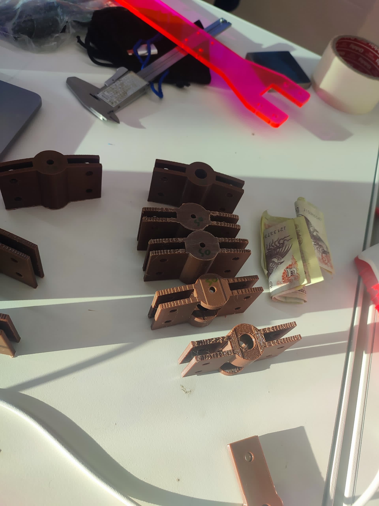

# Gyroscopic Test Rig
#### Sophia Wang and Tshering Dorji

  
    3-axis (yaw/pitch/roll) for tuning flight controller pre-launch.

## Assembly

  
    Assembly Diagram

## Parts 
### Tools
| Name | Purpose |
| ----------- | ----------- |
| Circular saw machine | aluminum extrusions|
| Sanding machine/sandpaper| aluminum extrusions |
| M4 and M5 allen keys | assembly|
| Wrench or needle nose plier | assembly|

### Frame
| Section | Part | Details | Quantity |
| ----------- | ----------- | ----------- | ----------- |
| Base | Aluminum Extrusion [^1] | 52.5 cm | 3 |
| Base | Aluminum Extrusion | 63 cm | 2 |
| Base | 2020 Corner Bracket | 30 mm x 30 mm | 8 |
| Base | M5x10, knurled cylinder head| | 16 |
| Base | M5 T-nut| | 16 |
| Column | Aluminum Extrusion | 60.5 cm| 2 |
| Column | 2020 Corner Bracket | 30 mm x 30 mm | 4 |
| Column | M5x10, knurled cylinder head| | 8 |
| Column | M5 T-nut| | 8 |
| Top beam | Aluminum Extrusion | 63 cm | 1 |
| Top beam | 2020 Corner Bracket | 30 mm x 30 mm | 2 |
| Top beam | M5x10, knurled cylinder head| | 4 |
| Top beam | M5 T-nut| | 4 |

[^1]: aluminum extrusions are 20 mm x 20 mm, T-Slot 80/20

### Rig
| Section | Part | Details | Quantity |
| ----------- | ----------- | ----------- | ----------- |
| Mount | Drone Mount | Laser Cut [^2] | 1 |
| Mount | Drone screw mount | 3D print [^3] | 1 |
| Mount | M5x15, knurled cylinder head |  | 8 |
| Mount | M5 nut [^4] |  | 8 |
| Inner Ring | Inner Ring | Laser Cut | 4 |
| Inner Ring | Inner ring screw mount | 3D print | 2 |
| Inner Ring | Inner ring bearing mount | 3D print | 2 |
| Inner Ring | M5x15, knurled cylinder head | ring interconnects | 16 |
| Inner Ring | M5 nut | ring interconnects | 16 |
| Inner Ring | M5x25, knurled cylinder head | bearing shaft [^5] | 2 |
| Inner Ring | M5 nut | bearing shaft | 4 |
| Inner Ring | Bearing (5x16x5mm)	 | | 2 |
| Outer Ring | Outer Ring | Laser Cut | 4 |
| Outer Ring | Outer ring screw mount | 3D print | 2 |
| Outer Ring | Outer ring bearing mount | 3D print | 2 |
| Outer Ring | M5x15, knurled cylinder head | ring interconnects | 16 |
| Outer Ring | M5 nut | ring interconnects | 16 |
| Outer Ring | M5x25, knurled cylinder head | bearing shaft | 2 |
| Outer Ring | M5 nut | bearing shaft | 4 |
| Outer Ring | Bearing (5x13x4mm) | | 2 |
| Frame | Frame Bearing Mount [^6] | 3D print | 2 |
| Frame | M4x30, button cap screw | bearing shaft | 2 |
| Frame | M4 nut | bearing shaft | 6 |

[^2]: 5.5 mm acrylic
[^3]: 30% infil
[^4]: If nuts are difficult to find, you can thread a self-tightening nut with significant elbow grease.
[^5]: We're working around the supply here. Better practice would be to use a fitted 5 mm shaft. Here, we're placing a loosely fitting 5 mm bolt through the shaft of the bearing, and securing with one nut at either end.
[^6]: Again, working around supply. Best case would have been to find some M5x30 bolts, but we were only able to find M4 ones of sufficient length. Here, we're securing the bearing against the head of the bolt and the exacting pressure of the aluminum columns (better to add another nut to relieve precision of extrusions), then securing the screw mount with two nuts.

## Our Process

    
  
   
    attempt 1

There was lots of trial and error. Our first attempt at nesting the rings was a miscalculation of the degrees of freedom from only one fastener on each side of the screw/bearing mount. These prints don't do well with threading. The shredded PLA you see below is the result of no-tolerance prints, which we quickly adjusted to + 0.15 mm to adjust for post plastic shrinkage. 

    
  
   
   
    attempt 2

On attempt 2, the realization set in that the M5 screw was too loose as a shaft for the bearing, and without a tight fitting shaft in supply, we opted for a handy nut to secure the bearing's rotational axis. You can see the shredded PLA as we tested this theory out on our existing bearing mounts and realized we needed to redesign to compensate for the extra nut. 

    
  
   
    attempt 3

Finally, we could begin cutting the extrusions for the frame and assemble!

    
  
   
    circular saw

